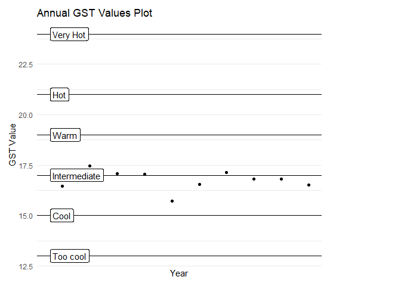

<!-- README.md is generated from README.Rmd. Please edit that file -->
[](https://travis-ci.org/pbulsink/GrapeWeatheR) [](https://codecov.io/gh/pbulsink/GrapeWeatheR)

GrapeWeatheR
============

The goal of GrapeWeatheR is to provide analysis of Environment Canada Climate Data for grape growers and agriculture purposes.

Examples
--------

### Download Data

We need to have weather data downloaded to analyze. We'll download data from Point Pelee for the last few years:

``` r
pelee_data<-weathercan::weather_dl(27533, interval = 'day', start = '2011-01-01', end = '2017-12-31')
```

### Index Calculation

With the data at hand, we can calculate a few climatological indecies. Winkler, Huglin and Biologically Effective Degree Day (BEDD) indecies are various ways of determining the suitability of an area or expecting the type of grapes that may be more suitable for a location. In addition, more annual indices are calculated, see Ramos et. al (2008).

``` r
annual_pelee <- calculate_annual_indicies(pelee_data)
annual_pelee
#> # A tibble: 7 x 40
#>   station_name  station_id climate_id WMO_id TC_id  elev   lat   lon  year
#>   <chr>              <dbl> <chr>      <chr>  <chr> <dbl> <dbl> <dbl> <int>
#> 1 POINT PELEE …      27533 613P001    71303  XPT    177.  42.0 -82.5  2011
#> 2 POINT PELEE …      27533 613P001    71303  XPT    177.  42.0 -82.5  2012
#> 3 POINT PELEE …      27533 613P001    71303  XPT    177.  42.0 -82.5  2013
#> 4 POINT PELEE …      27533 613P001    71303  XPT    177.  42.0 -82.5  2014
#> 5 POINT PELEE …      27533 613P001    71303  XPT    177.  42.0 -82.5  2015
#> 6 POINT PELEE …      27533 613P001    71303  XPT    177.  42.0 -82.5  2016
#> 7 POINT PELEE …      27533 613P001    71303  XPT    177.  42.0 -82.5  2017
#> # ... with 31 more variables: GSTavg <dbl>, GSTmax <dbl>, GSTmin <dbl>,
#> #   GST_region <chr>, WI <dbl>, WI_region <chr>, HI <dbl>,
#> #   HI_region <chr>, BEDD <dbl>, BEDD_region <chr>, FFD <dbl>,
#> #   F_Growing <int>, F_Annual <int>, ND_25 <int>, ND_30 <int>,
#> #   NDT_Min_90p <int>, NDT_Max_90p <int>, NDT_Min_10p <int>,
#> #   NDT_Max_10p <int>, DTR <dbl>, P_Annual <dbl>, P_Growing <dbl>,
#> #   P_Max <dbl>, NP95p <int>, PP95p <dbl>, P_I <dbl>, P_II <dbl>,
#> #   P_III <dbl>, P_IV <dbl>, P_V <dbl>, DPL <dbl>
```

We can see that the past few years of BEDD indicies have shown the Pelee region to be Temperate, Warm Temperate, Warm Temperate, Temperate, Temperate, Temperate, Temperate.

### Plotting

We can plot results as well.

``` r
plot_index_history(pelee_data, index = 'GST')
```



Citations
---------

Gladstones, J. 1992. Viticulture and Environment. Winetitles, Adelaide. Huglin, P. 1978. Nouveau Mode d'Evaluation des Possibilites Heliothermiques d'un Milieu Viticole. C.R. Acad. Agr. France 64:1117-1126 Ramos, M.C., Jones, G.V., and Martinez-Casasnovas, J.A. 2008. Clim Res 38:1-15 Want, T., Hamann, A., Spittlehouse, D.L., and Carrol, C. 2016. Locally downscaled and spatially customizable climate data for historical and future periods for North America. PLoS One 11: e015672 Winkler, A.J., J.A. Cook, W.M. Kliewer, and L.A. Lider. 1974. General Viticulture. 4th ed. University of California Press, Berkeley.
