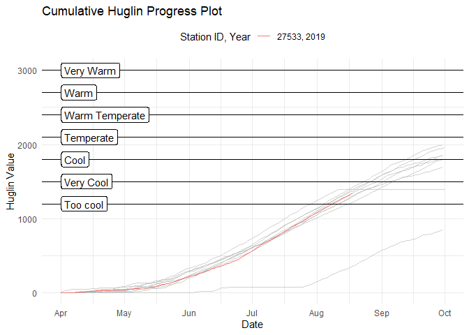
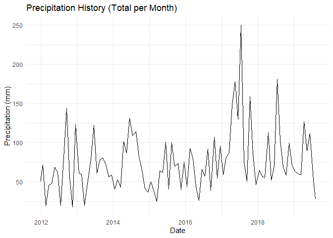
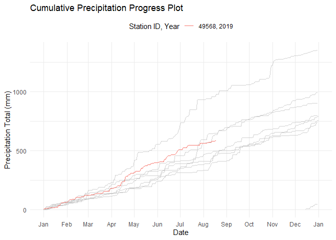

<!-- README.md is generated from README.Rmd. Please edit that file -->

[](https://travis-ci.org/pbulsink/GrapeWeatheR)
[](https://codecov.io/gh/pbulsink/GrapeWeatheR)

# GrapeWeatheR

The goal of GrapeWeatheR is to provide analysis of Environment Canada
Climate Data for grape growers and agriculture purposes.

## Examples

### Download Data

We need to have weather data downloaded to analyze. We’ll download data
from Point Pelee for the last few
years:

``` r
pelee_data<-weathercan::weather_dl(27533, interval = 'day', start = '2010-01-01')
```

### Index Calculation

With the data at hand, we can calculate a few climatological indecies.
Winkler, Huglin and Biologically Effective Degree Day (BEDD) indecies
are various ways of determining the suitability of an area or expecting
the type of grapes that may be more suitable for a location. In
addition, more annual indices are calculated, see Ramos et. al (2008).

``` r
annual_pelee <- calculate_annual_indicies(pelee_data)
annual_pelee[,c("year", "GST_region", "WI_region", "HI_region", "BEDD_region")]
#> # A tibble: 10 x 5
#>     year GST_region   WI_region HI_region BEDD_region   
#>    <int> <chr>        <chr>     <chr>     <chr>         
#>  1  2010 Intermediate Region II Temperate Temperate     
#>  2  2011 Warm         Region II Temperate Temperate     
#>  3  2012 Warm         Region I  Very Cool Warm Temperate
#>  4  2013 Warm         Too Cool  Too Cool  Warm Temperate
#>  5  2014 Intermediate Region I  Cool      Temperate     
#>  6  2015 Intermediate Region II Temperate Temperate     
#>  7  2016 Warm         Region II Temperate Temperate     
#>  8  2017 Intermediate Region II Cool      Temperate     
#>  9  2018 Intermediate Region II Temperate Temperate     
#> 10  2019 Intermediate Region I  Very Cool Too Cool
```

We can see that the past few years of BEDD indicies have shown the Pelee
region to be Temperate, Temperate, Warm Temperate, Warm Temperate,
Temperate, Temperate, Temperate, Temperate, Temperate, Too Cool.

### Plotting Temperature

We can plot some annualized results as well.

``` r
plot_index_history(pelee_data, index = 'GST')
```

<!-- -->

Or, we can show the daily progression in degree growing days:

``` r
plot_index_progress(pelee_data, "Huglin")
```

<!-- -->

### Plotting Precipitation

Precipitation also matters for viticulture. `GrapeWeatheR` can evaluate
and plot precipitation metrics as well. We’ll use Ottawa data, as Point
Pelee has limited precipitation data available. We can plot
precipitatoin on a daily, weekly, monthly, or annual
basis.

``` r
ottawa_data<-weathercan::weather_dl(49568, start = '2010-01-01', interval = 'day')

plot_precip_history(ottawa_data, interval = 'month', trim_years = 10)
```

<!-- -->

As with the indecies, you can also plot ‘progression’ of precipitation
accumilation for a region.

``` r
plot_precip_progress(ottawa_data)
```

<!-- -->

## Citations

  - Gladstones, J. 1992. Viticulture and Environment. Winetitles,
    Adelaide.
  - Huglin, P. 1978. Nouveau Mode d’Evaluation des Possibilites
    Heliothermiques d’un Milieu Viticole. C.R. Acad. Agr. France
    64:1117-1126
  - Ramos, M.C., Jones, G.V., and Martinez-Casasnovas, J.A. 2008. Clim
    Res 38:1-15
  - Want, T., Hamann, A., Spittlehouse, D.L., and Carrol, C. 2016.
    Locally downscaled and spatially customizable climate data for
    historical and future periods for North America. PLoS One 11:
    e015672
  - Winkler, A.J., J.A. Cook, W.M. Kliewer, and L.A. Lider. 1974.
    General Viticulture. 4th ed. University of California Press,
    Berkeley.
